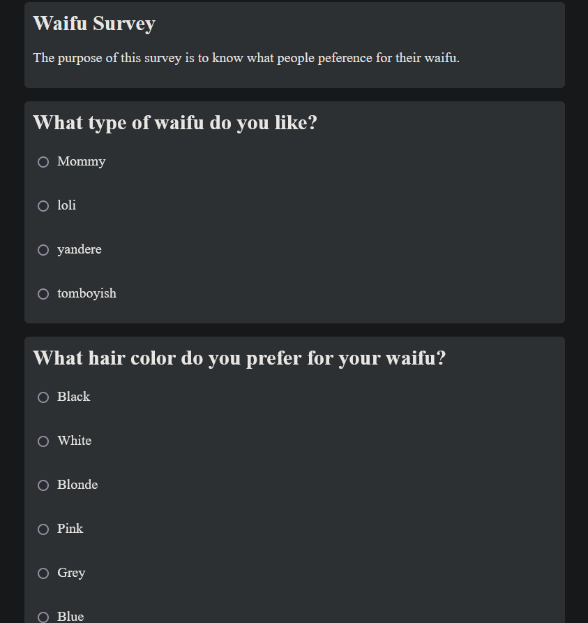

## KU Polls: Online Survey Questions 
  
An application to conduct online polls and surveys based on the [Django Tutorial project](https://docs.djangoproject.com/en/5.1/intro/tutorial01/), with additional features.

This app was created as part of the [Individual Software Process](
https://cpske.github.io/ISP) course at [Kasetsart University](https://www.ku.ac.th).

# UI
  

## Install and Run
### Requirements: 
 - Python 3.12.3  
### Install:  
 - `$ python -m venv .venv`
 - Activate the created virtual environment.
 - `$ pip install -r requirements.txt`
 - `$ python ./manage.py migrate`
### Run:  
 - `$ python ./manage.py runserver`

## Project Documents
All project documents are in the [Project Wiki](../../wiki/Home).  
- [Vision Statement](../../wiki/Vision)  
- [Requirements](../../wiki/Requirements)  
- [Project Plan](../../wiki/KU-Polls-Project-Plan)  
- [Iteration 1 Plan](../../wiki/Iteration-1-Plan)  
- [Iteration 2 Plan](../../wiki/Iteration-2-Plan)  
- [Iteration 3 Plan](../../wiki/Iteration-3-Plan)  
